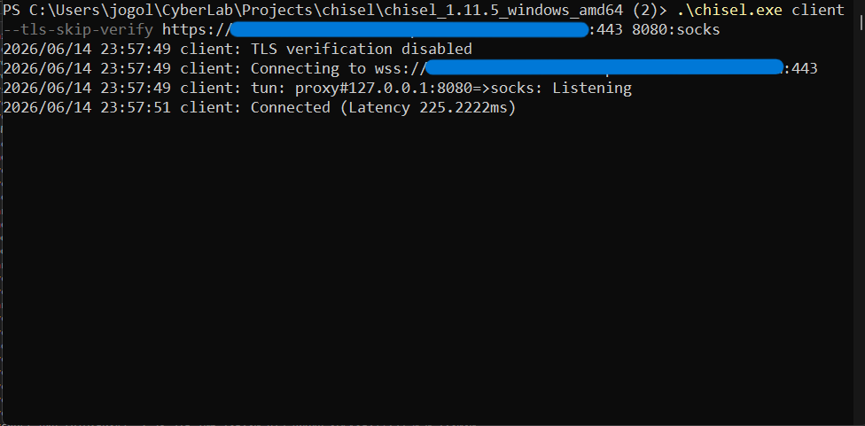
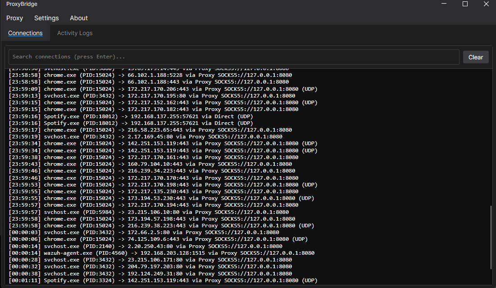
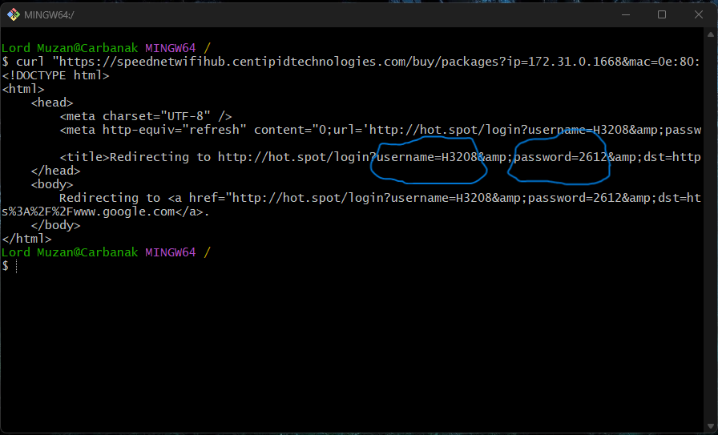

# SPEEDNET-WIFI Vulnerability Disclosure

> Three HIGH-severity findings in a commercial captive WiFi portal — a payment-enforcement bypass (now remediated), unlawful data processing and user surveillance (unresolved), and a plaintext credential IDOR (partially mitigated) — disclosed responsibly and published after a 90-day remediation window closed with two of three findings still unaddressed.

## Overview

SPEEDNET-WIFI is a commercial paid WiFi service built on the Centipid Technologies captive portal platform. Independent security research conducted between May and August 2026 identified three distinct HIGH-severity findings spanning payment-enforcement bypass, unlawful data processing, and credential exposure — each assigned a CVSS 3.1 base score of 7.5.

All three findings were reported directly and privately to the network operator under a standard 90-day responsible disclosure window. One was fixed. Two were not. This repository documents what was found, what was fixed, what wasn't, and why a captive portal that requires payment for internet access ended up being the easiest thing in this whole assessment to get around for free.

## Disclosure Timeline

| Date | Event |
|---|---|
| May 7, 2026 | Findings 1 & 2 discovered during independent research on SPEEDNET-WIFI |
| May 8, 2026 | Finding 3 discovered; reported to operator same day following validation |
| May 9, 2026 | Finding 1 full report delivered privately; 90-day remediation window begins |
| Jun 2026 | Finding 2 scope expanded to five distinct privacy violations; severity revised to HIGH |
| Aug 6, 2026 | Finding 3 remediation window closes |
| Aug 7, 2026 | Findings 1 & 2 remediation window closes |
| Aug 8, 2026 | Public disclosure published — Finding 1 remediated, Findings 2 & 3 unresolved/partial |

## Finding 1 — Captive Portal Egress Bypass via Wildcard Domain Trust
**`SPEEDNETWIFI-2026-001` · CVSS 3.1: 7.5 HIGH (`AV:N/AC:L/PR:N/UI:N/S:U/C:H/I:N/A:N`) · Status: ✅ REMEDIATED — Researcher-Verified**

The gateway's egress whitelist included a `*.amazonaws.com` wildcard trust entry, exempting any AWS-hosted hostname from payment enforcement. Because AWS EC2 instances receive public DNS hostnames that fall within that wildcard, an unauthenticated user could provision a $0 EC2 instance, stand up a TLS-tunneling endpoint on it, and route all outbound traffic through it — bypassing payment enforcement entirely, confirmed across both single- and multi-device scenarios.

The whitelist trusted a *namespace*, not an *owner*. Any AWS customer — including a free-tier account created five minutes earlier — could provision an endpoint inside it.

**Confirmed remediation:** the wildcard entry has been removed. Independent researcher retest confirms tunnel establishment to an AWS-hosted exit node is no longer possible.


`Tunnel establishment confirmed`



`System-wide SOCKS5 routing confirmed`


`Unrestricted browsing confirmed, no payment`


## Finding 2 — Unlawful Data Processing & Persistent User Surveillance
**`SPEEDNETWIFI-2026-002` · CVSS 3.1: 7.5 HIGH (`AV:N/AC:L/PR:N/UI:N/S:U/C:H/I:N/A:N`) · Status: ❌ UNRESOLVED**

Five distinct privacy violations, confirmed through technical testing and Centipid's own published platform documentation:

- **No consent mechanism** — personal data (phone numbers, for M-Pesa processing) collected with no Terms of Service, Privacy Policy, or consent flow, despite Centipid explicitly building and marketing a GDPR/PDPA-compliant opt-in checkbox as a core platform feature that SPEEDNET has left unconfigured.
- **Persistent cross-session profiling** — returning users are recognized and profiled across visits, with behaviour-based triggers and up to 24 months of retention, undisclosed.
- **Undisclosed third-party data transfers** — native integrations (Meta Pixel, Google Analytics, CRM platforms, unrestricted webhooks/Zapier) can silently ship user data to international third parties.
- **Device identifier collection & cross-location tracking** — MAC-based session identifiers, logged and linkable to phone numbers and timestamps, with cross-location correlation capability if the operator runs multiple sites.
- **Undisclosed TLS inspection** — the gateway performs man-in-the-middle TLS termination on unauthenticated traffic, confirmed via handshake-origin analysis, with the technical capability to read plaintext HTTPS content — never disclosed anywhere in the user-facing experience.

This is a compliance and consent failure, not a code bug — it maps directly to obligations under the **Kenya Data Protection Act 2019**. The gap sits between three parties: Centipid built and markets the compliance controls, SPEEDNET chose not to enable them, and end users have no visibility into any of it.

## Finding 3 — Plaintext Credential Disclosure via Insecure Direct Object Reference
**`SPEEDNETWIFI-2026-003` · CVSS 3.1: 7.5 HIGH (`AV:N/AC:L/PR:N/UI:N/S:U/C:H/I:N/A:N`) · CWE-639 + CWE-522 · Status: 🟡 PARTIALLY MITIGATED**

The portal's device-authorization endpoint — used by a paid customer to retrieve their own login credentials for a second device — accepts the client's IP, MAC address, and router ID as plain request parameters and returns the account's **username and password in plaintext**, without verifying the requester actually owns the session those identifiers describe.


`Plaintext credentials presented to an authenticated user which can be used in a second device`


That's an Insecure Direct Object Reference: authorization is derived from client-supplied, non-secret values instead of a server-issued session token. Two of those three values require no effort to obtain — the router ID is a static constant shared by every user on the deployment, and a device's MAC address is broadcast in cleartext in every WiFi frame it sends, observable by anyone in range with a card in monitor mode. No interaction with the target is required.

**Confirmed using only researcher-owned devices** — a second device under the researcher's own control, assigned a spoofed MAC not tied to any paid session, was used to retrieve credentials belonging to the researcher's own separate paid account. No third-party account or data was ever accessed.

**Partial mitigation observed on retest:** credentials retrieved this way can now authenticate only one additional device, down from unlimited at time of discovery. That throttles casual sharing — it does not fix the underlying issue. The endpoint still hands out plaintext credentials to any caller who supplies a valid identifier triplet, with two of the three requiring zero effort to obtain. Full technical reproduction is documented in the private report delivered to the operator and available to verified parties on request; it's withheld here because Centipid's platform is used by other deployments that were never in scope of this research and never had a remediation window of their own.

Of the three findings, this is the one that matters most in practice: Finding 1 needed a provisioned EC2 instance and tunneling software to exploit. This needs a WiFi card in monitor mode and a browser.

## Why This Matters — The Complete Picture

```
 ┌─────────────────────────┬──────────────────────────┬───────────────────────────┐
 │      FINDING 1           │      FINDING 2            │      FINDING 3            │
 │   Payment Bypass          │   Unlawful Surveillance    │   Credential IDOR          │
 ├─────────────────────────┼──────────────────────────┼───────────────────────────┤
 │ Status: REMEDIATED        │ Status: UNRESOLVED        │ Status: PARTIAL            │
 │ Cost to exploit: $0 AWS   │ Cost to exploit: N/A       │ Cost to exploit: $0        │
 │   account + tunneling     │  (passive data exposure   │  (WiFi card, monitor mode) │
 │   software                │   by design)               │                            │
 │ Skill floor: Moderate     │ Skill floor: N/A           │ Skill floor: Low           │
 │ Victim interaction: None  │ Victim interaction: None   │ Victim interaction: None   │
 └─────────────────────────┴──────────────────────────┴───────────────────────────┘
```

## Responsible Disclosure Statement

All three findings were delivered directly and privately to the SPEEDNET-WIFI network operator, each with a committed 90-day remediation window before any public disclosure, consistent with industry-standard responsible disclosure practice. All testing was limited to devices under the researcher's own control; no third-party account, device, or traffic was ever accessed. Finding 1 was fixed within the window and independently retested by the researcher. Findings 2 and 3 were not resolved, or only partially mitigated, despite the full remediation period. This publication follows that expired window, per the policy stated in the original report.

## Researcher

**Atlas** ·

Available to assist with vulnerability verification, remediation validation, or technical clarification at any stage.

*Full technical disclosure report with CVSS scoring rationale, kill chain, and evidence available on request to verified recipients.*
